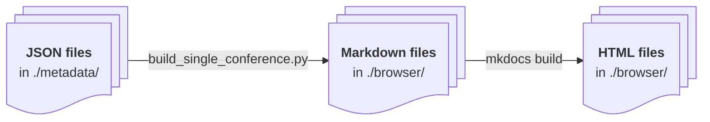
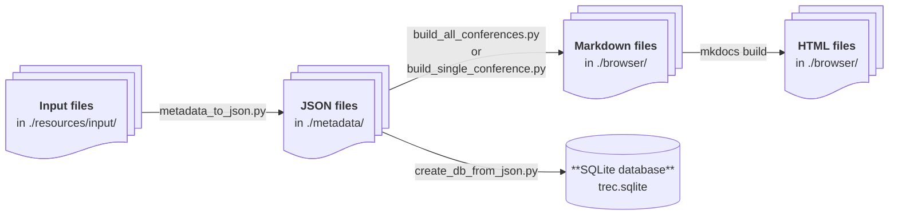

# trec-pages-builder

> [!NOTE]
> This repository contains the build files and metadata of the [TREC Browser](https://pages.nist.gov/trec-browser/). Below, you find an overview of the repository structure, as well as guides of ["How to populate the TREC Browser with new data"](#how-to-populate-the-trec-browser-with-new-data) and ["Complete steps to build the TREC Browser pages and the database"](#complete-steps-to-build-the-trec-browser-pages-and-the-database).

## Repository structure

| Directory | Description | 
| --- | --- | 
| `resources/input/` | All resources to create the JSON-formatted metadata are located here. | 
| `browser/` | Markdown (`docs`) files of the browser can be found here. The HTML (`site`) files will be placed here. | 
| `metadata/` | JSON-formatted metadata |
| `scripts/` | The build scripts can be found here. |  

## How to populate the TREC Browser with new data

> [!NOTE]
> To add new data, e.g., from last year's conference, it is not required to re-run the entire pipeline (see below). Adding new data is basically a four step process:
> 1. Add JSON-formatted metadata to the `metadata/` directory.
> 2. Run either the build script `build_all_conferences.py` or `build_single_conference.py`.
> 3. Build the HTML files with `mkdocs build`.
> 4. Commit the HTML files to the [`nist-pages`](https://github.com/usnistgov/trec-browser/tree/nist-pages) branch of the [`trec-browser`](https://github.com/usnistgov/trec-browser) repository.



### Setup of the Python environment

Create a virtual environment and activate it: 
```
python -m venv .venv && . ./.venv/bin/activate
```

Install the packages:
```
pip install -r requirements.txt
```

### Adding JSON-formatted metadata 

Each conference has a separte folder, e.g., `trec8`. Within that directory, there should be several JSON files that contain the metadata. The following table helps to add new JSON metadata pointing to existing examples and JSON schemas.

| JSON file | Example | Schema |
| --- | --- | --- |
| `abstracts.json` | [:link:](./metadata/trec8/abstracts.json) | [:link:](https://github.com/isoboroff/trec-pages-builder/wiki/JSON-Schema#abstracts) |
| `datasets.json` | [:link:](./metadata/trec8/datasets.json) | [:link:](https://github.com/isoboroff/trec-pages-builder/wiki/JSON-Schema#datasets) | 
| `publications.json` | [:link:](./metadata/trec8/publications.json) | [:link:](https://github.com/isoboroff/trec-pages-builder/wiki/JSON-Schema#publications) |
| `publications.json` | [:link:](./metadata/trec8/publications.json) | [:link:](https://github.com/isoboroff/trec-pages-builder/wiki/JSON-Schema#publications) |
| `results.json` | [:link:](./metadata/trec8/results.json) | [:link:](https://github.com/isoboroff/trec-pages-builder/wiki/JSON-Schema#results) |
| `runs.json` | [:link:](./metadata/trec8/runs.json) | [:link:](https://github.com/isoboroff/trec-pages-builder/wiki/JSON-Schema#runs) |
| `tracks.json` | [:link:](./metadata/trec8/tracks.json) | [:link:](https://github.com/isoboroff/trec-pages-builder/wiki/JSON-Schema#tracks) |

> [!IMPORTANT]
> **Adding publication metadata:** `publications.json` contains the metadata of the publications including different fields and also the BibTeX data. You can compile `publications.json` as follows:
> 1. Create an `abstracts.json` file in the directory of the conference that is added. For each track, single papers have the BibTeX identifier as key and contains key-value pairs of the participant identifier `pid` and the abstract of the publication (cf. [this example](.metadata/trec8/abstracts.json)).  
> 2. Additionally, add the BibTeX data to `resources/input/bibtext/trec.bib`. The BibTeX identifier is used to associate the entries in `abstracts.json` with the full BibTeX data. Note that  `abstracts.json` is only required to generate `publications.json`, it won't be used for building the Markdown files.  
> 3. Finally, run `python scripts/parse_publications.py` and `publications.json` should be created in the directory of the conference.

You then need to assemble the master input JSON files:
> 1. run `python scripts/assemble_json.py metadata abstracts.json resources/input/json/abstracts.json`
> 2. run `python scripts/assemble_json.py metadata publications.json resources/input/json/publications.json`

### Build the Markdown files 

To build the Markdown files for all conferences that are contained within the `metadata/` directory run `build_all_conferences.py`. Note that it is not required to rebuild all Markdown files as they are contained in this repository for past conferences.
```
python scripts/build_all_conferences.py
```

Alternatively, you can build Markdown files for a specific conference.
```
python scripts/build_single_conference.py trec8
```
(substitute the conference you are building for `trec8`.)

### Build the HTML files 

Once the files in browser/docs/ are generated, run the following command to build the HTML files. 
```
cd browser && mkdocs build 
```

If you have added a new conference, or a section (like runs or proceedings) to an existing conference, you need to update the navigation in the mkdocs.yml file.

Optionally, you can run the browser locally to double-check the results:
```
mkdocs serve
```
or
```
cd site && python -m http.server
```

Finally, commit the HTML files to the [`nist-pages`](https://github.com/usnistgov/trec-browser/tree/nist-pages) branch of the [`trec-browser`](https://github.com/usnistgov/trec-browser) repository.

## Complete steps to build the TREC Browser pages and the database

> [!NOTE]
> The following describes the entire pipeline to generate the HTML pages from the available resources. Note that the available JSON files do not need to be rebuild and can be found in `metadata/`. Use this workflow for verification and tracking data provenance.



### Setup of the Python environment

Create a virtual environment and activate it: 
```
python -m venv .venv && . ./.venv/bin/activate
```

Install the packages:
```
pip install -r requirements.txt
```

### Converting resources to JSON files

Convert the metadata to JSON-formatted files that can be found in `metadata/` afterwards:
```
python scripts/metadata_to_json.py
```

### Build the Markdown files 

Build all Markdown browser files (`metadata_to_json.py` needs to be executed first, see above):
```
python scripts/build_all_conferences.py
```

Alternatively, you can build Markdown files for a specific conference:
```
python scripts/build_single_conference.py
```

### Build the HTML files 

Once the files in browser/docs/ are generated, run the following command to build the HTML files. 
```
cd browser/src/ && mkdocs build 
```

Optionally, you can run the browser locally to double-check the results:
```
mkdocs serve
```

The browser HTML files can then be pushed to [https://github.com/usnistgov/trec-browser](https://github.com/usnistgov/trec-browser).

### Build the SQLite database

Optionally, you can create a SQLite database from the JSON files, e.g., to use it with the REST-API:
```
python scripts/create_db_from_json.py
```
